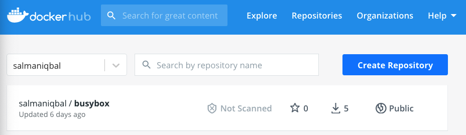
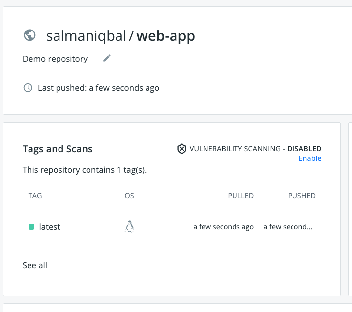

## Docker Exercises

Imagine you have an application, which you can run on your machine. No matter what framework it uses or which language it is written in, there is a high chance it can be containerised.

We can use two types of containers, Linux & Windows. Windows containers are generally larger in size compared to Linux containers. For these exercises we will use Linux containers as it will save us time in downloading, building and deploying the containers. The process of building a Linux or Windows container is exactly the same. Examples for Windows containers have been included in the `extra-exercises` folder.

### Run Docker containers

Open terminal, and run the following command

`docker pull nginx`  
This pulls a docker image on your machine, nginx is a webserver.

Run this command to see if the image has been downloaded:
`docker images`

Check if any containers are running, there shouldn't be
`docker ps`

Run the image
`docker run -d --name=first-container nginx`  
`-d`: runs the container in background
`--name`: name given to the running conatiner
`nginx`: this is the image name that needs to be run

Check if the container is running, have a look at what information this command provides
`docker ps` 

If you want to stop the container run
`docker stop <container_name>` e.g. `docker stop first-container`

Run `docker ps` to check if container has stopped.

Nginx is capable to running websites, we can use the following command to run the container and access the website from our browser:

`docker run -d -p 8090:80 --name=first-web nginx`

`-p`: Binds a port on your local machine to a port in the container. `8090` is the port on your machine and `80` is the port inside the container. Since the container is running on port 80 by default we have to bind it to that port to send and recieve traffic successfully. 

Open your browser and type `http://localhost:8090`, you should see a web page that says `Welcome to nginx!`. This shows that the request from your browser on port `8090` is being forwarded to port `80` in the container. 

In order to see all stopped containers you can run:
`docker ps -a`

If you would like to stop the container you can run:
`docker stop [Container Id | Container Name]`

If you want to stop all running containers in one command:
_Powershell_:
`docker ps -q | % { docker stop $_ }`

_Git Bash_:
`docker stop $(docker ps -q)`


### Dockerfile

As you can see that we can run a pre-built container. Now it is time to build our own container. 

You will be running all of the commands from your own repo that you created in the previous Github exercise. Open your command line terminal and navigate to your github repository's root directory

In that directoy you should have two files:
`index.html`: This is a static html file that you can double click and open in your browser and see its contents.
`Dockerfile`: We will use to build a docker image. Think of this file as a set of instructions that need to be completed in order to run the application.

Let's have a look at the Dockerfile

```Dockerfile
FROM nginx:latest
COPY ./index.html /usr/share/nginx/html/index.html
```

`FROM`: This command tells us which which base image to use. In this case we are using a light weight web server. Think IIS web server but a lot smaller. The base image can be any operating system like [Windows](https://hub.docker.com/_/microsoft-windows-base-os-images), linux, python, dotnet, Java etc. 

`COPY`: COPY <Source on localhost> <Destination inside container>
This command specifies source & destination. The `index.html` from your current directory on your machine will be copied into `/usr/share/nginx/html/` directory inside the container. When the container is built, the file will the included in it. You can also copy directories into the container. 

There are other commands that can also be used in the docker file:

`RUN`: runs a command to install packages into container, create folders, etc 
`ENV`: sets environment variable  
`COPY`: copies files and directories into the container 
`EXPOSE`: expose ports comment 
`ENTRYPOINT`: provides command and arguments for an executing container 
`CMD`: provides a command and arguments for an executing container. 
`VOLUME`: create a directory mount point to access and store persistent data. 
`WORKDIR`: sets the working directory for the instructions that follow. 
`LABEL`: provides metada like maintainer. 

From the current directory where we have our docker file, let's build our own image

`docker build -t web-app .`

`build`: builds the image 
`-t`: tag, the name of the image 
`web-app`: the given name 
`.`: the location of Dockerfile, in this case, the current directory 

Check if your docker image has been built successfully by running the command:
`docker images` 

Can you see an image called `web-app`?

Now it is time to run our image.

`docker run -d -p 8091:80 --name=my-container web-app`

Navigate to `localhost:8091` to view the index.html page running inside the container. Congratulations you have successfully built and ran a container. If you were to build a different container, you will have to follow the same process:
- Pick a base image
- Add specific commands to install the right packages
- Copy the require files into the container
- Build and run it!

You can use similar process to build containers for any framework. 

## Container Registry

A container registry is a respository for storing and sharing container images. In Azure cloud platform you will be using [Azure Container Registry](https://azure.microsoft.com/en-gb/services/container-registry/). The container registry in sit/uat/prod environment will have very strict access controls e.g. only an automated pipelines can push images to the registry, specific kubernenetes clusters will be able to pull images from that registry.

For our training we will use [Docker Hub](https://hub.docker.com/) as a container registry for our exercise to show how you can use it to push and store images. Please __DO NOT__ use it to push any Bank of England containers to this repository.

If you do not have an account in Docker Hub head over to the [Docker Hub Signup page](https://hub.docker.com/signup) to create one. Please use your personal email address for this.

Once you have created an account, run the following command in git bash in your current project's root directory:

`docker login -u USERNAME -p PASSWORD`
 
You can include your password in speech marks `"mysupersecurepassowrd"`

Provide your username and password in your terminal. If the output says `login succeeded`, you are all set. 

Head over to [https://hub.docker.com/](https://hub.docker.com/) and click on `Create Repository` button.



Create a new repository with the name `we-app`, we will be using this repository to push images. Keep the `Visibility` as `Public`. Click on `Create`


We can use the `docker tag` command to tag an image that exists locally with the name of your repository and push it to container registry.

Run:

`docker images`

You should see an image listed as `web-app`, Version `latest`. 

We will tag this image using a command that looks like this:

`docker tag local-image:tagname new-repo:tagname`

Let's replace the placeholder names. Please replace the `your-user-name` below with your Docker Hub Username

`docker tag web-app:latest your-user-name/web-app` 

Run `docker images` to see if your newly tagged image appears.

Let's push this image to your Docker Hub Registry. Please replace the `your-user-name` below with your Docker Hub Username.

`docker push your-user-name/web-app`

Once pushed, head over to your repository in Docker Hub to confirm that an image with the `latest` tag has been pushed.



`Extra challenge`: Can you delete the `your-user-name/web-app` image locally and pull it from your Docker Hub container registry?
