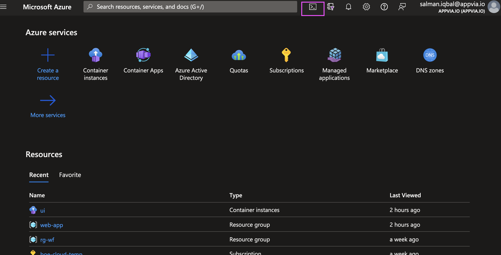
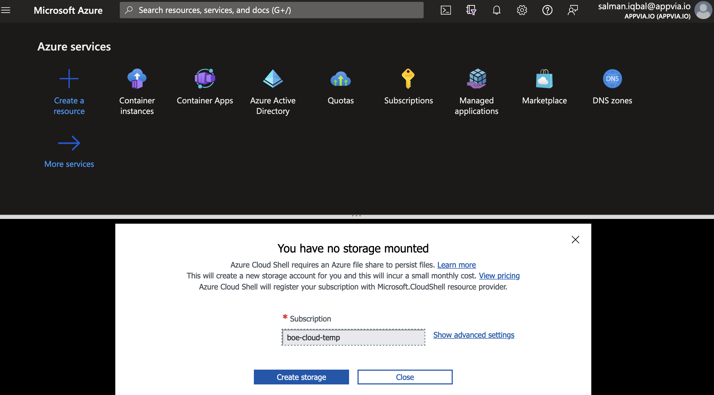
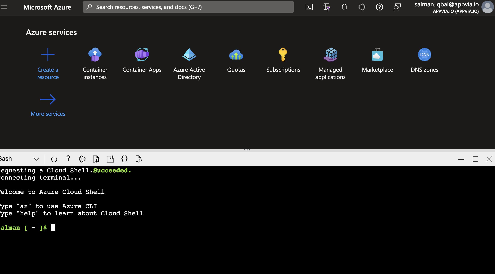
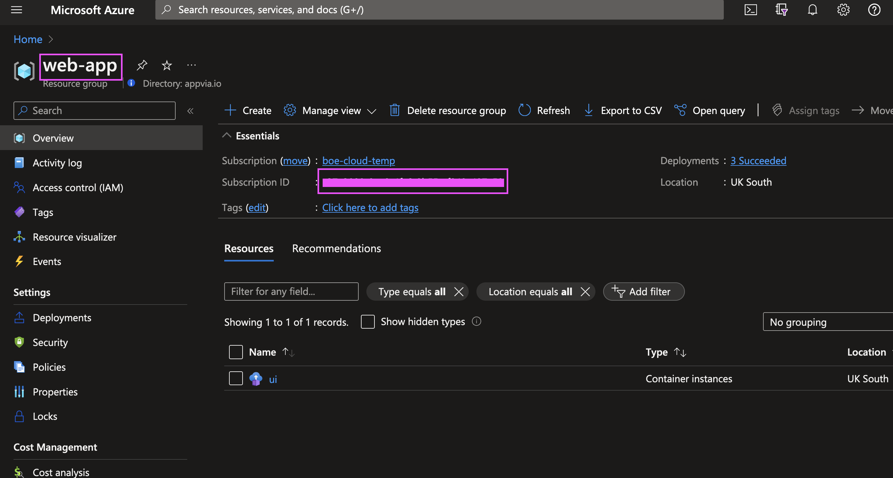
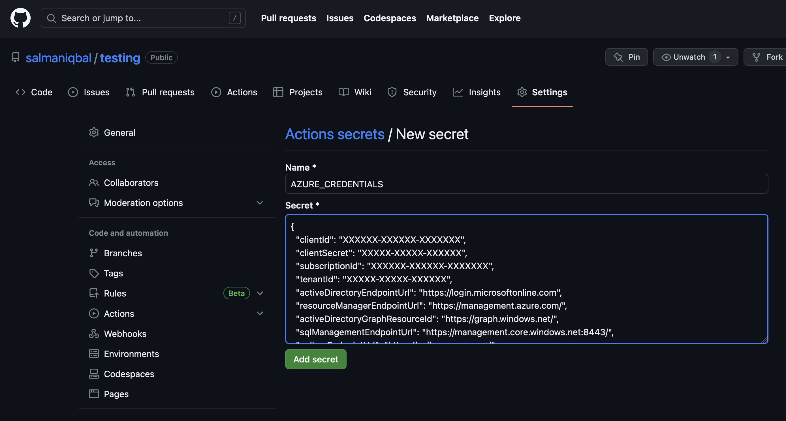
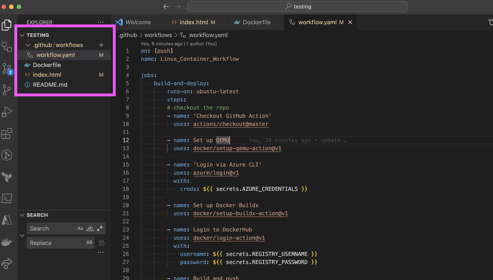
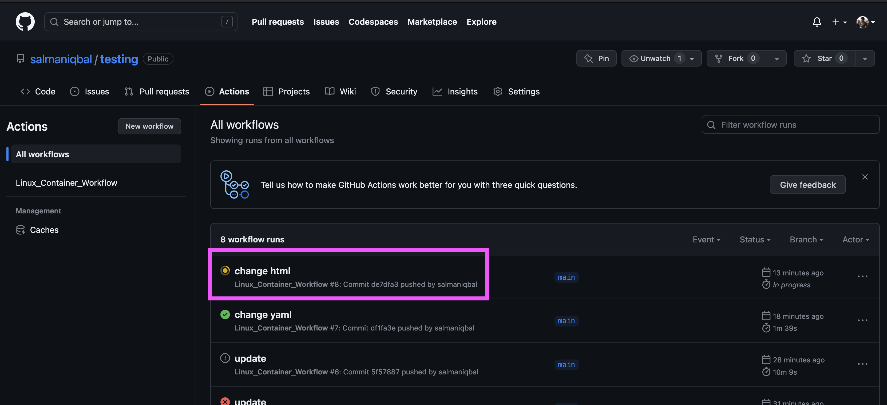
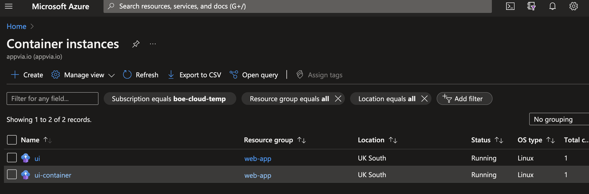

# Deploying Application to Azure


## Deploying via Azure Portal
Containerisation has revolutionised the way we develop, package, and deploy applications. With the rise of microservices architecture and the need for efficient resource utilization, deploying containers has become a fundamental aspect of modern application development. Azure Container Instances (ACI), as part of the Azure ecosystem, offers a robust and flexible solution to deploy and manage your containers seamlessly.


1. Login to [Azure Portal](https://portal.azure.com/)
2. In the search box, type `Container Instances` and click on `Container Instances` from the search results


3. Click on `Create` to create a new container instance


4. Fill in the details on the `Basics` tab
   1. Subscription: Select your subscription or create new
   2. Resource Group: Click on `Create new` and give it a name e.g. `web-app`
   3. Container name: `ui`
   4. Region: `(Europe) UK South`
   5. Availability zones: `None`
   6. Image Source: select `Other registry`
   7. Image type: `Public`
   8. Image: `ghcr.io/appvia/hello-world/hello-world:main` - or use the image that was built in the previous exercise and pushed to docker hub
   9. OS type: `Linux`
   10. Size: `1 vcpu, 1.5 GiB memory, 0 gpus`

5. Click on `Next: Networking`
6. Fill in the details on the `Networking` tab
   1. Network: `Public`
   2. DNS name label: leave this field blank
   3. DNS name label scope reuse: `Any reuse (unsecure)`
   4. Ports: `8080` - Ports protocol: `TCP`
   5. Delete the existing entry for port `80`


7. Click on `Review + create`
8. On the new screen a prompt for `Validation Passed` will appear, click on `Create` to create the container instance


9. It will take a few minutes for container instance to deploy. Once the container instance is created, click on `Go to resource` to see the details of the container instance.


10.  On the `Overview` tab, you will see the details of the container instance. Copy the `Public IP address`.


11.   Open browser and paste the IP address with the Port 8080 e.g. `20.254.9.87:8080` . You will see the running container.


Congratulations, you have just deployed your first container instance on Azure!

## Deploying via CI/CD pipeline

In this section, we will create a CI/CD pipeline to deploy the application to Azure Container Instances. We will use GitHub Actions to create the pipeline.

1. Login to [Azure Portal](https://portal.azure.com/)
2. On the top right corner, click on `Cloud Shell` icon to open the cloud shell



3. Pick the subscription you want to use for this exercise and click on create storage



4. Once the storage is created, you will see the cloud shell prompt



5. Cloud shell will be used to generate the secrets required by the GitHub Actions pipeline to deploy the application to Azure Container Instances. Run the following commands in the cloud shell to generate the secrets

6. In Azure search box, search for `Resource Groups` and click on `Resource Groups` from the search results
7. Select your resource group e.g. `web-app` 
8. On the overview page, copy the `Resource group name` and `Subscription ID` 



9. In the cloud shell, run the following command to generate the `AZURE_CREDENTIALS` secret

```bash
az ad sp create-for-rbac --name "myApp" --role contributor \
                             --scopes /subscriptions/{subscription-id}/resourceGroups/{resource-group} \
                             --sdk-auth
```
Replace `{subscription-id}` with `Subscription ID` and `{resource-group}` with `Resource Group name` from previous step

10. Copy the output of the above command and save it in a text editor. You will need it in the next step. It will look something like this

```json
{
  "clientId": "XXXXXX-XXXXXX-XXXXXXX",
  "clientSecret": "XXXXX-XXXXX-XXXXXX",
  "subscriptionId": "XXXXXX-XXXXXX-XXXXXXX",
  "tenantId": "XXXXX-XXXXX-XXXXXX",
  "activeDirectoryEndpointUrl": "https://login.microsoftonline.com",
  "resourceManagerEndpointUrl": "https://management.azure.com/",
  "activeDirectoryGraphResourceId": "https://graph.windows.net/",
  "sqlManagementEndpointUrl": "https://management.core.windows.net:8443/",
  "galleryEndpointUrl": "https://gallery.azure.com/",
  "managementEndpointUrl": "https://management.core.windows.net/"
}
```

11. In github.com open the repository that was created in the first exercise

12. On the tabs look for - Settings > Secrets and Variables > Actions > New Repository Secret 
    1.  Secret Name: `AZURE_CREDENTIALS`
    2.  Value: Paste the output of the previous command
    3.  Click `Create`



13. If DockerHub secrets have not been set, add two more secrets:
    1.  Secret Name: `REGISTRY_USERNAME` - Value: Docker Hub username
    2.  Secret Name: `REGISTRY_PASSWORD` - Value: Docker Hub password

14. There should be 3 configured secrets


15. Open the repository that was created in the first exercise
16. Add a `workflow.yaml` file in the `.github/workflows` directory with the following content

```yaml
on: [push]
name: Linux_Container_Workflow

jobs:
    build-and-deploy:
        runs-on: ubuntu-latest
        steps:
        # checkout the repo
        - name: 'Checkout GitHub Action'
          uses: actions/checkout@master

        - name: Set up QEMU
          uses: docker/setup-qemu-action@v1
          
        - name: 'Login via Azure CLI'
          uses: azure/login@v1
          with:
            creds: ${{ secrets.AZURE_CREDENTIALS }}
        
        - name: Set up Docker Buildx
          uses: docker/setup-buildx-action@v1

        - name: Login to DockerHub
          uses: docker/login-action@v1 
          with:
            username: ${{ secrets.REGISTRY_USERNAME }}
            password: ${{ secrets.REGISTRY_PASSWORD }}

        - name: Build and push
          id: docker_build
          uses: docker/build-push-action@v2
          with:
            push: true
            tags: salmaniqbal/web-app:latest

        - name: 'Deploy to Azure Container Instances'
          uses: 'azure/aci-deploy@v1'
          with:
            resource-group: web-app
            dns-name-label: url-for-container
            registry-login-server: docker.io
            image: salmaniqbal/web-app:latest
            cpu: 1
            memory: 1.5 
            registry-username: ${{ secrets.REGISTRY_USERNAME }}
            registry-password: ${{ secrets.REGISTRY_PASSWORD }}
            name: ui-container
            location: 'uk south'
```

17. NOTE: replace `salmaniqbal` above with the name of your dockerhub username.
18. The directory structure should look like this
    


19. Commit the changes to the repository and push to GitHub
20. Go to the repository in GitHub.com and click on `Actions` tab
21. You will see the workflow running



22. Click on the workflow to see the details
23. Once the workflow is completed, this will create a new image in docker hub registry and deploy it into Azure Container Instance
24. Go to [Azure Portal](https://portal.azure.com) and search for `Container Instance` in search box
25. You will see the newly created container instance, `ui-container`



25. In the overview tab, copy the `Public IP address` open a new browser tab and paste the IP address to see the newly deployed container
26. Make changes to html file and push it to the repository to see the changes deployed automatically.