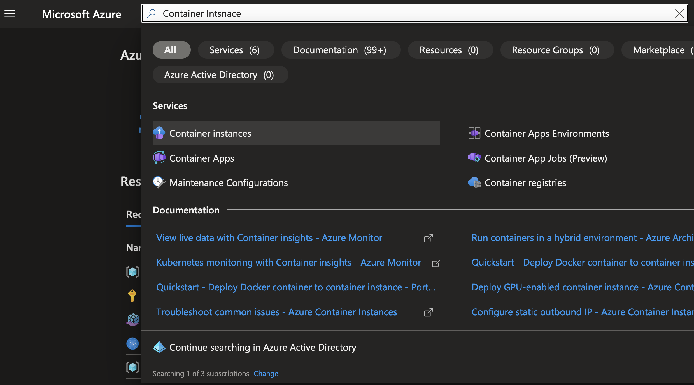
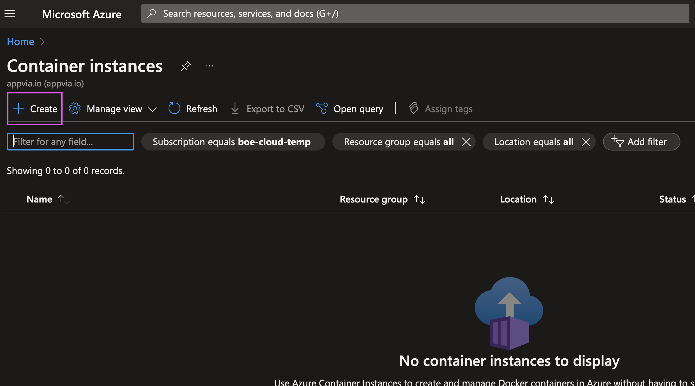
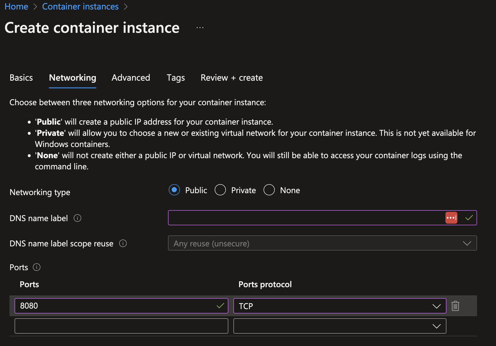
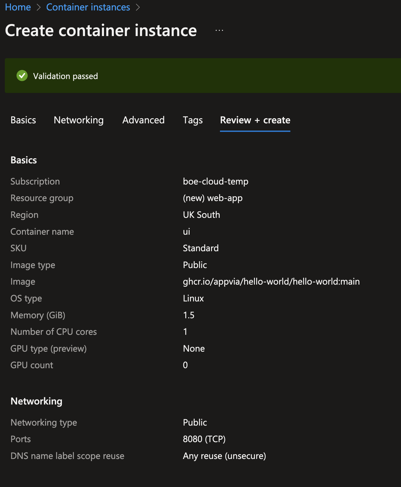
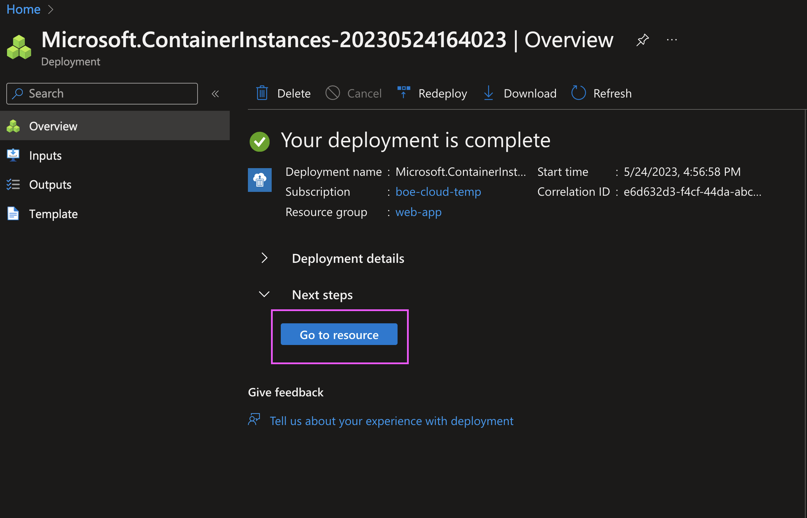
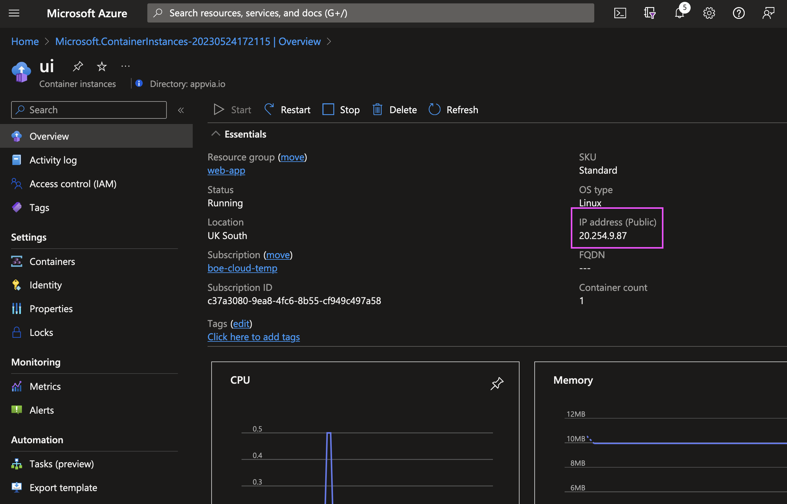
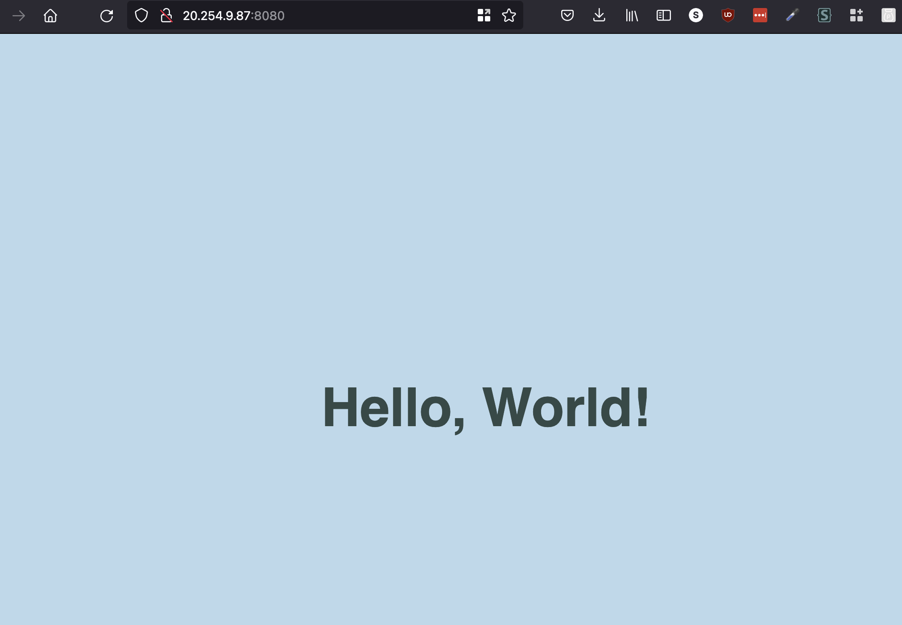

# Deploying Application to Azure

## Deploying via Azure Portal
Containerisation has revolutionised the way we develop, package, and deploy applications. With the rise of microservices architecture and the need for efficient resource utilization, deploying containers has become a fundamental aspect of modern application development. Azure Container Instances (ACI), as part of the Azure ecosystem, offers a robust and flexible solution to deploy and manage your containers seamlessly.

1. Login to [Azure Portal](https://portal.azure.com/)
2. In the search box, type `Container Instances` and click on `Container Instances` from the search results

3. Click on `Create` to create a new container instance

4. Fill in the details on the `Basics` tab
   1. Subscription: Select your subscription or create new
   2. Resource Group: Click on `Create new` and give it a name e.g. `web-app`
   3. Container name: `ui`
   4. Region: `(Europe) UK South`
   5. Availability zones: `None`
   6. Image Source: select `Other registry`
   7. Image type: `Public`
   8. Image: `ghcr.io/appvia/hello-world/hello-world:main` - or use the image that was built in the previous exercise and pushed to docker hub
   9. OS type: `Linux`
   10. Size: `1 vcpu, 1.5 GiB memory, 0 gpus`

5. Click on `Next: Networking`
6. Fill in the details on the `Networking` tab
   1. Network: `Public`
   2. DNS name label: leave this field blank
   3. DNS name label scope reuse: `Any reuse (unsecure)`
   4. Ports: `8080` - Ports protocol: `TCP`
   5. Delete the existing entry for port `80`

7. Click on `Review + create`
8. On the new screen a prompt for `Validation Passed` will appear, click on `Create` to create the container instance

9. It will take a few minutes for container instance to deploy. Once the container instance is created, click on `Go to resource` to see the details of the container instance.

10.  On the `Overview` tab, you will see the details of the container instance. Copy the `Public IP address`.

11.   Open browser and paste the IP address with the Port 8080 e.g. `20.254.9.87:8080` . You will see the running container.

Congratulations, you have just deployed your first container instance on Azure!

## Deploying via CI/CD pipeline