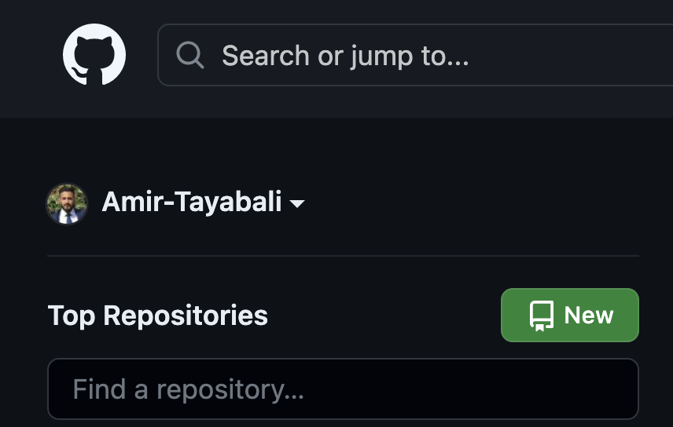
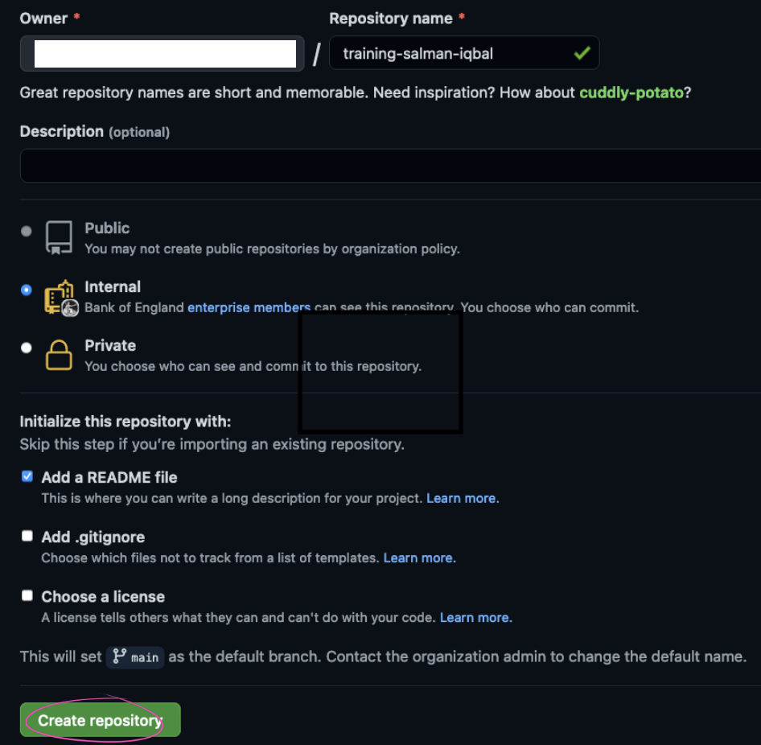
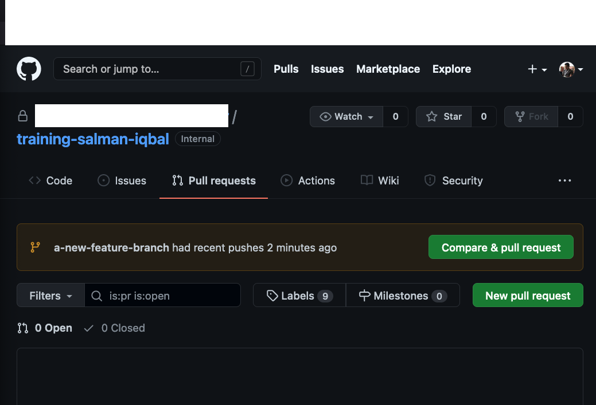
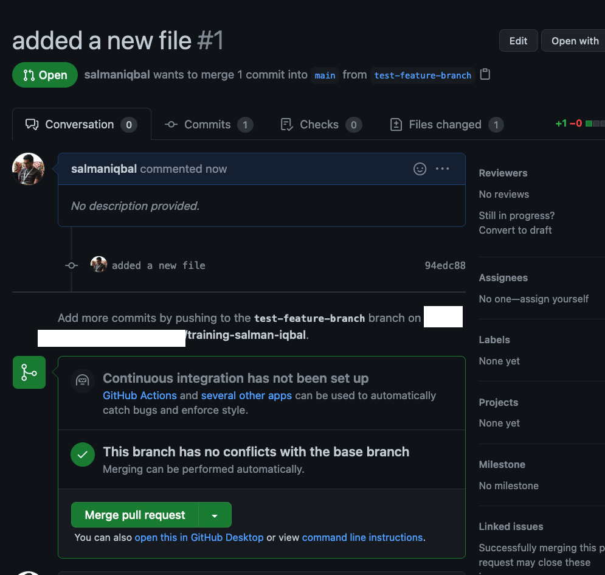

## Github Setup

### Clone Repository 

In this exercise you will be creating your own Github repository which you will be using throughout the training.

Navigate to [https://github.com/bank-of-england-technology](https://github.com/bank-of-england-technology)

Click on the "New" button



Fill in the following settings:
Repository Name: training-your-full-name e.g. training-salman-iqbal (please make sure you include training as repo name prefix)
Description: Repo used for training
Select repository as Internal
Select "Add a README file" -> this file allows you to add description about your repository



At this point you have your own blank repository with a README file. This repository exists in github.com, it is now time to clone this repository to your machine. If you closed your repository windown you can find your repository by heading over to [Bank of England Technology github](https://github.com/bank-of-england-technology). Use the `Find a repository...` search box to look for your repo. 

Once located, click on the `Code` button and select the `HTTPS` tab, copy the URL and open a terminal, you can use command prompt/powershell/git bash. All insctructions you see in the demo are using `Git bash`. Navigate to `github` directory in your `C` drive and clone the repo using YOUR repository's HTTPS URL. If you do not have a `github` directory, please create one in your `C` drive.

`cd /c/github` 

Now you can use `git clone` to clone your repository, e.g.
`git clone https://github.com/bank-of-england-technology/training-firstname-lastname.git` 

This will clone your repo onto your machine. You can now navigate into the repository by running:

`cd training-firstname-lastname` (replace firstname-lastname with your repo name)

In the root directory of your repository create a new file named `index.html` and add the following lines in the file:

```html
<!doctype html>
<html lang="en">
<head>
  <meta charset="utf-8">
  <title>Docker</title>
</head>
<body>
  <h2>Hi, I am your friendly website</h2>
</body>
</html>

```

Create another file named `Dockerfile` and add the following lines in the file:

```Dockerfile
FROM nginx:latest
COPY ./index.html /usr/share/nginx/html/index.html
```

In your repository now you should have, two new files. We will be using these files later on.

```
.
├── Dockerfile
├── README.md
└── index.html
```

Open your folder in an IDE of your choice e.g. Visual Studio code to see the files.

For all newly created repositorys the default branch is `main`. When working in a team it is encouraged not to check your changes directly into the `main` branch. Changes should be added in a different branch and merged into main after being reviewed by a team member. You can create branch protection rules on your repository to enforce a workflow of your choice e.g. code can only be checked into `main` branch if approved via a Pull Request. For future reference, you can have a look at [this page](https://docs.github.com/en/github/administering-a-repository/defining-the-mergeability-of-pull-requests/managing-a-branch-protection-rule) on how to create branch protection rules.

Initially you will be checking into the main branch directly to show you the process. 

You are now ready to commit files from your machine (local) to the your remote github repository. If you are more comfortable in using UI, you can download and install GitHub desktop from [here](https://desktop.github.com/). 

In git bash ensure that you are in your repository folder. Run the following, this will show the status of files, how many are to be added etc:

`git status`

Add the files to the staging area so they can be pushed to the remote repository when ready.

`git add Dockerfile index.html`

Note: If you would like to add all files, you can use `git add .` or `git add -A`. However, it is sometimes discouraged to run `git add .` as we could by mistake add files to the commit that we might not need. If you would like to exclude files from not being checked into remote repository you can use a `gitignore` file. Have a look at [this documentation](https://git-scm.com/docs/gitignore) for further details.

Run `git status` again to see what has changed from previous step. 

You can now commit the files. 

`git commit -m "adding file for training application"`

`-m`: is the commit message, it appears in the repository's history. It is good practice to make the message meaningful so you and your colleagues can understand the intent of the commit.

Run `git status` again to check the changes from previous step. 

Now you are ready to push the changes.

`git push`

Head over your repository on github.com to confirm if the files have successfully been pushed!

Well done, you created a repository and pushed changes to it.

### Create Branch and Create Pull Request

Usually when you work on a repository you will:
1. Create a new branch on your local repository, usually called a feature branch. It is good practice to give a meaningful name to the branch. As a team, there are many conventions you can follow, have a look at [this](https://deepsource.io/blog/git-branch-naming-conventions/) as an example.
1. Commit the branch to remote repository 
1. Create a Pull Request to get your changes reviewed by your colleague(s) 
1. merge into the `main` branch when pull request is approved
1. You can delete the old branch when no longer required. Have [a look](https://ardalis.com/why-delete-old-git-branches/) at this article on some practies for deleting old branches. Some teams might keep the old branches until it is released to production.

Let's create a new branch. In git bash navigate to your repository that you created and run the following:

`git checkout -b test-feature-branch` 

This will create a new branch called `test-feature-branch` and checkout the branch for you.

To list all local branches run: `git branch`  

If you would like to list all remote branches run: `git branch -r`  

We will add a new file to your branch, in git bash run:

`echo hello > file.txt` 

This will create a new file in your folder. 

Run `git status` to view the status.

Add the file so we can commit the changes:

`git add file.txt` 

Check the status again: `git status` 

Let's commit the changes: `git commit -m "added a new file"`

`-m` flag is used to add a meaningful message with the commit. 

Now we are ready to push the changes.

If you just run: `git push`, you will get an error saying that the branch does not exist in remote repository and it will give you a command to push your local repository into remote repository:

`git push --set-upstream origin test-feature-branch`

If the branch already exists in remote then `git push` will suffice.

Navigate to your repository in a web browser. Click on the `Pull requests` tab and click the `Compare & pull request` button.



In the new window, you can add a comment about what changes you are making. This will help your colleague in reviewing your changes. Click the `Create pull request` button at the bottom of the page. Pull request will now be created which will be visible to you and your colleagues. Since this is just an exercise, you will be reviewing and merging your changes.

New page will open which will show the changes you have made. You can click on the `Commits` tab to see the commits and the `Files changed` tab to see all the files that have been added. In the `Files changed` tab you can click on the `Review changes` button to add any comments that you would like.



Once you are happy, you can click on the `Conversation` tab and merge the pull request by clicking on the `Merge pull request` button and click `Confirm merge`. If you head back to the `Code` tab of your repo, you will see the new file now added into the `main` branch.

Can you figure out a way of deleting your feature branch from remote repository?

Once done, head over to your git bash terminal checkout the main branch and pull all latest changes in your main branch:

`git checkout main`  
`git pull` 

Your main branch is now up to date.